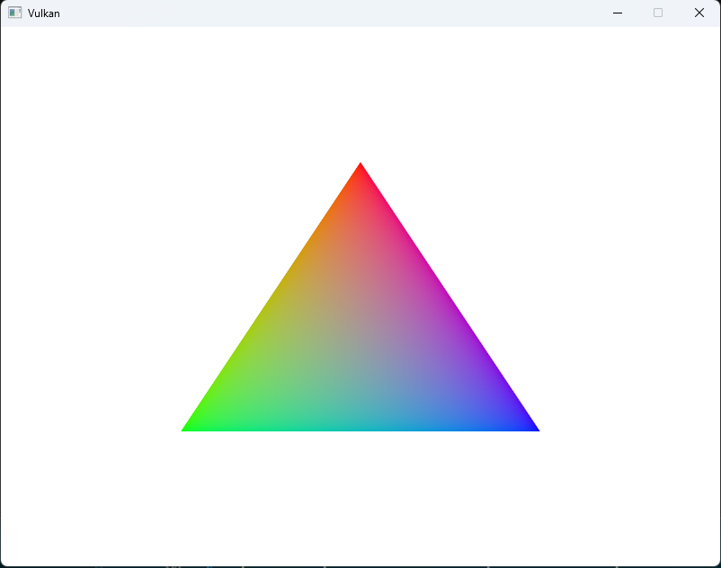

# Vulkan-Toybox

A modern C++ framework for learning and experimenting with Vulkan graphics programming. This project provides a structured foundation for building Vulkan applications, with a clean and reusable architecture.

## Project Structure

``` bash
vulkan-toybox/
├── common/         # Core Vulkan wrapper library
└── toys/          # Collection of example applications
```

## Features

- **Modern C++ Design**: Built with C++20, utilizing modern language features
- **RAII Resource Management**: Automatic resource cleanup and lifecycle management
- **Modular Architecture**: Cleanly separated components for easy understanding and modification
- **Vulkan Best Practices**: Implements Vulkan programming patterns and best practices

### Core Components

- **Core**: Basic Vulkan instance, device, and window management
- **Graphics**: Pipeline, shader, and command management
- **Resources**: Buffer, image, and memory management
- **Sync**: Synchronization primitives management

## Toy Examples

| Name | Description | Preview |
|------|-------------|----------|
| Triangle | Basic triangle rendering demonstrating vertex buffers and graphics pipeline |  |

## Building

### Prerequisites

- CMake 3.20+
- Vulkan SDK 1.3+
- GLFW3
- GLM
